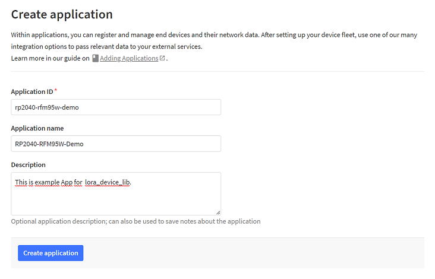
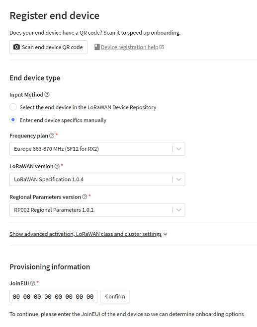
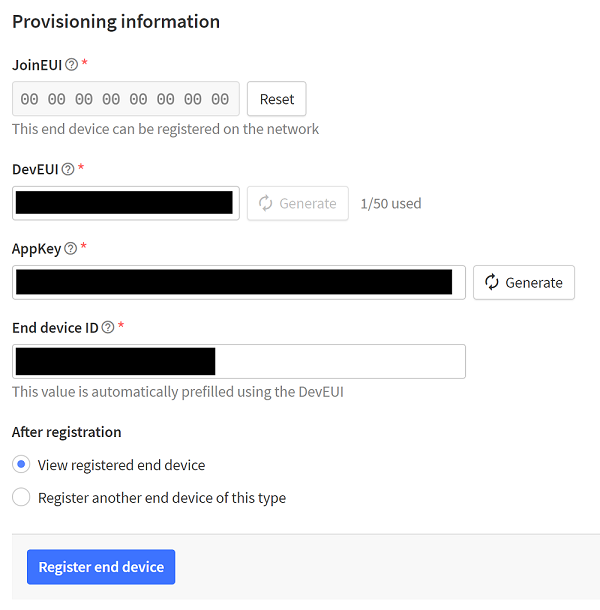

# Example for Raspberry Pi Pico RP2040 with HOPERF LoRa Module RFM95W

## Overview

This is the functional example for Raspberry Pi Pico RP2040 with HOPERF LoRa Module RFM95W (breakout board) connecting to [The Things Network](https://www.thethingsnetwork.org/).

## Components

- [Raspberry Pi Pico RP2040](https://www.raspberrypi.com/products/raspberry-pi-pico/)
- [RF Transceiver Module RFM95W (SX1276)](https://www.hoperf.com/modules/lora/RFM95.html)
  - [RFM95W breakout board](https://www.soselectronic.com/products/hoperf/con-rfm95-182634)
- An Account in the [The Things Network Console](https://console.cloud.thethings.network/)

## Tested Configuration

- Communication was tested in the European region with European regulations and configurations applied.
- LoRaWAN Gateway hosted by [TTN](https://www.thethingsnetwork.org/) community
- OTAA (Over-The-Air Activation) device activation method
- Europe 863-870 MHz (SF12 for RX2)
- LoRaWAN 1.0.4
- RP002 Regional Parameters 1.0.1

## Raspberry Pi Pico RP2040 and RFM95W Wiring

You will need 9 wires (7 data wires + 2 power supply wires).

See following diagrams:

- [Raspberry Pi Pico Pinout](https://pico.pinout.xyz/)
- [HopeRF RFM95 breakout board pinout](https://reuben.honigwachs.de/post/rfm95-breakout-board/)

| RPI Pico Pin Name      | RPI Pico Pin Number                    | RFM95 breakout board Pin Name | RFM95 breakout board Pin Number              |
| ---------------------- | -------------------------------------- | ----------------------------- | -------------------------------------------- |
| GPIO 06                | PIN 09                                 | RST                           | 10                                           |
| GPIO 07                | PIN 10                                 | nSS                           | 09                                           |
| GPIO 08                | PIN 11                                 | DIO 0                         | 05                                           |
| GPIO 09                | PIN 12                                 | DIO 1                         | 04                                           |
| GPIO 16 (SPI0 MISO/RX) | PIN 21                                 | MISO                          | 06                                           |
| GPIO 18 (SPI0 SCK)     | PIN 24                                 | SCK                           | 08                                           |
| GPIO 19 (SPI0 MOSI/TX) | PIN 25                                 | MOSI                          | 07                                           |
| 3V3 Out                | PIN 36                                 | 3V3                           | Any PIN 11, 12, 13, 17                       |
| GND                    | Any PIN 03, 08, 13, 18, 23, 28, 33, 38 | GND                           | Any PIN 14, 15, 16, 18, 19, 20               |

## TTN Application and Device registration

To communicate with TTN you need to register TTN application, register the device and generate communication keys.

Configuration below is region specific (Europe) and is subject to regional regulations. Your configuration might be different in your region.

See the [LoRaWAN specific regional regulations](https://resources.lora-alliance.org/technical-specifications/rp002-1-0-4-regional-parameters).

Go to the [The Things Network Console](https://console.cloud.thethings.network/) and select optimal region for you.

- Go to the Applications.
- Click "Create Application"
  - Provide application ID, Name and Description. 
    You can specify any values you like. Values are not critical for the communication itself.
- Click "Register End Device"
  - Select "Enter end device specifics manually"
    - Specify Frequency plan - In our case "Europe 863-870 MHz (SF12 for RX2)" 
      TTN recommends not default LoRaWAN option "Europe 863-870 MHz (SF9 for RX2 - recommended)" but
      because this library uses hardcoded LoRaWAN default value 869525000 (SF12 869.525 MHz) 
      select "Europe 863-870 MHz (SF12 for RX2)". 
      For downlink, The Things Network uses one additional fixed frequency for the RX2 receive slot: 869.525 MHz at DR0 (SF12 / 125 kHz).
      See [EU863-870 default channels](https://www.thethingsnetwork.org/docs/lorawan/regional-parameters/#eu863-870-default-channels)
      and [Frequency Plans](https://www.thethingsindustries.com/docs/reference/frequency-plans/)
    - Specify LoRaWAN version - In our case "LoRaWAN Specification 1.0.4" 
      This is currently the latest recommended version implemented in the library.
    - Specify Regional Parameters version - In our case "RP002 Regional Parameters 1.0.1" 
      This is currently the latest recommended version implemented in the library.
    - Do NOT change settings in advanced activation option
    - Set the field "JoinEUI" all to zeros (16 zeroes in total).
    - Click "Confirm"
    - For the field "DevEUI" do NOT specify a value - Click the button "Generate" next to the field.
    - For the field "AppKey" do NOT specify a value - Click the button "Generate" next to the field.
    - Do NOT change the value in the field "End device ID" unless you know what you are doing.
    - Click "Register end device" button

